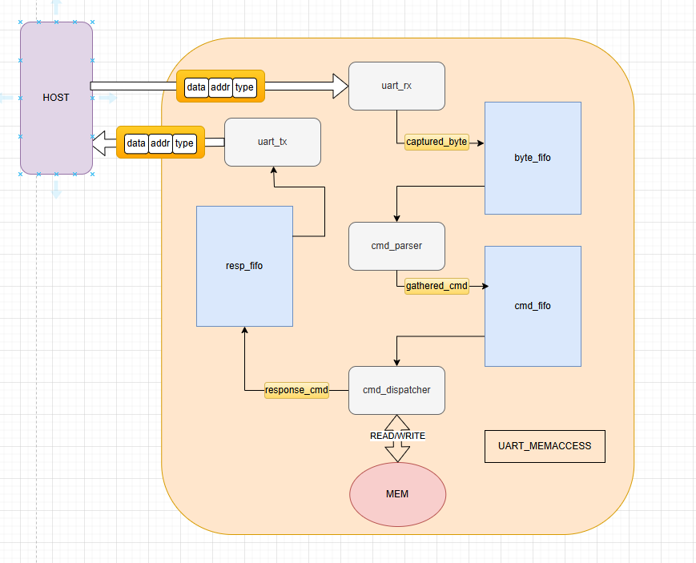
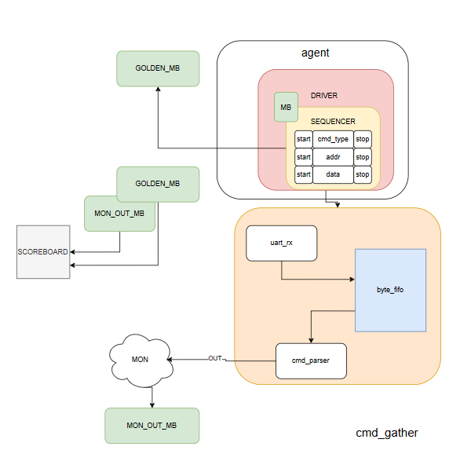
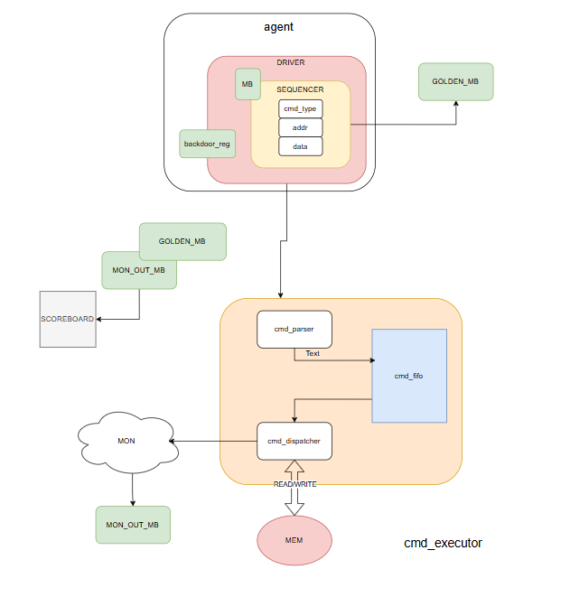
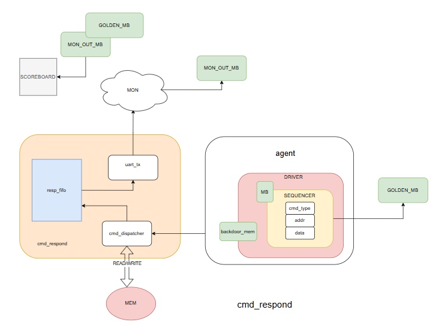

# UART FPGA - MEMACCESS

## Overview
This project features **UART communication** between the **Nexys A7 FPGA** and a host PC, reading and writing memory on the fpga with a defined command structure that can be understood by both. It also provides UVM-Lite architecture to verify the full RTL with scoreboarding, agents, drivers and monitors in a **block-level** and **system-level** structure. This repo provides tcl command to build this project to be ran and tested with *Xilinx Vivado*.

Board Part: ```xc7a50ticsg324-1L```




## Directory Structure
```
---sim
    |_block
    |    |_cmd_gather/
    |    |_cmd_execute/
    |    |_cmd_respond/
    |
    |_common
    |    |_uvm/
    |
    |_system/

---src
    |_block
    |    |_cmd_execute.f
    |    |_cmd_gather.f
    |    |_cmd_respond.f
    |_common
    |    |_cmd_pkg.sv
    |_core
    |    |_cmd_dispatcher.sv
    |    |_cmd_parser.sv
    |    |_ram.sv
    |
    |_fifo
    |    |_byte_fifo.sv
    |    |_cmd_fifo.sv
    |    |_resp_fifo.sv
    |
    |_system
    |    |_mem_access_top_level.sv
    |
    |_uart
         |_baud_tick_gen.sv
         |_uart_rx.sv
         |_uart_tx.sv

```

## Architecture Description
One of the most distinct notes of this design is its use of a agreed upon ```command``` from UART to FPGA. This command structure is as follows:

```
 ----8 bits------     ----8 bits------   ----8 bits------
_________________    _________________   _________________
|                |  |                |   |                |
|___cmd_type_____|  |___cmd_addr_____|   |___cmd_data_____|
```
 - The ```cmd_type``` either READ (=0) or WRITE (=1) to control what event.
 - The ```cmd_addr``` describing what address to access in the memory
 - And finally the ```cmd_data``` which is the relevant data for the command

It is important to note that this arhitecture receives and transmits both this structure in the following order: CMD_TYPE, CMD_ADDR and then CMD_DATA.


## Verification Environment Overview
In order to verify this architecture in a way that covers all major points in the design this was first verified as block-level and the blocks are named as such:
|Block | Testbench |Coverage Goal |
|---|---|---|
| CMD_GATHER | cmd_gather_tb | UART Byte proper receiving and storing |
| CMD_EXECUTE | cmd_execute_tb | Assembling and Executing commands received from UART |
| CMD_RESPOND | cmd_respond_tb | Correctness in UART retransmission |
| MEM_ACCESS | mem_access_tb | System Level command flow from host PC to FPGA back to host |

All these methodologies are very similar in that they utilize:
 - monitors
 - scoreboards
 - sequencers
 - agents
 - drivers
 - mailboxes

 This methodology is used to scoreboard ```Expected``` vs. ```Output``` to verify correct functionality of the DUT. This is used in all blocks as well as system level testing.

---


### CMD_GATHER:

- Receives bytes from UART and stores them in a FIFO (byte_fifo) until a full command is assembled.
    - **GOAL**: Receive Command Bytes from Host PC, pass them along to (byte_fifo) to be assembled by command_parser
    - **Key Features**: UART_RX, BYTE_FIFO, CMD_PARSER


### CMD_GATHER_TB

---

### CMD_EXECUTE
- Assembled bytes from (byte_fifo) into commands to be stored in (cmd_fifo), to be used to execute said commands/
    - **GOAL**: Turn bytes into commands and commands into executed functions.
    - **Key Features**: CMD_PARSER, CMD_FIFO, CMD_DISPATCHER
### CMD_EXECUTE_TB



---

### CMD_RESPOND
- Gathering data taken from executing commands and responding back to host PC
    - **GOAL**: Sample data from executed command, respond back to host PC via UART transmission.
    - **Key Features**: CMD_DISPATCHER, RESP_FIFO, UART_TX


### CMD_RESPOND_TB

---


### MEM_ACCESS


### MEM_ACCESS_TB


### MEM_ACCESS
